# TrafficXShaper V2

ML-powered auto-scaling for Docker Swarm across AWS and Azure.

TrafficXShaper collects live infrastructure and Nginx metrics, evaluates scaling signals, uses ML prediction during gray-zone load, and manages worker node lifecycle through a distributed set of FastAPI services and shell-based node agents.

## Project Summary

TrafficXShaper is built around one idea: scaling should happen from live workload behavior, not from manual guesses. Every worker node reports machine-level metrics and Nginx connection statistics. A gateway server turns those raw logs into one cluster-level metric window. The broker then decides whether the cluster is healthy, overloaded, missing nodes, or sitting in a gray zone where an ML prediction is useful.

When scale-up is required, the broker sends a request to the decision engine. The decision engine creates workers on AWS and Azure, passes Docker Swarm join commands through cloud-init/user-data, records pending instances, and sends an alert. Scale-down is handled separately through a manager/self-draining flow so a node is removed only after capacity checks and Docker Swarm drain approval.

The system is split into services because each responsibility belongs on a different machine during testing and deployment:

- Worker nodes collect raw metrics.
- The gateway aggregates metrics.
- The broker owns scale-up decisions.
- The ML service owns prediction and model history.
- The decision engine owns cloud actions.
- The manager owns safe Swarm draining.
- The alert service owns notification delivery.

## System Architecture

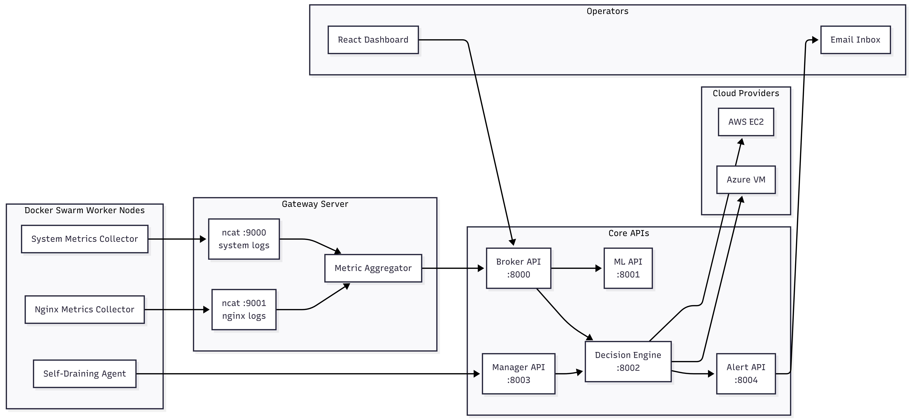

At a high level, TrafficXShaper behaves like a control plane around a Docker Swarm cluster. Worker nodes do not decide when to scale up; they only report what is happening. The broker receives the cluster view and becomes the central decision point. The decision engine is separated from the broker so cloud-provider actions stay isolated from metric and ML logic.

## Request Flow

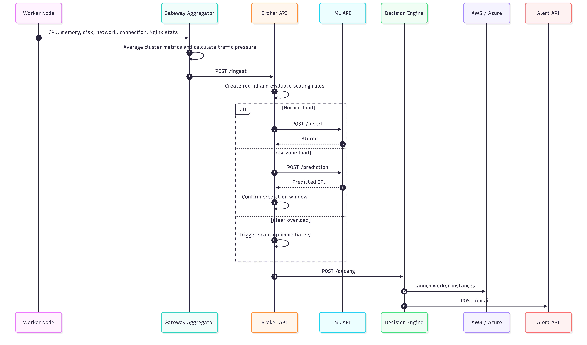

The request flow starts with raw telemetry and ends with infrastructure change. The broker generates one `req_id` for the scale-up chain and forwards it using `X-Request-ID`, so the same event can be traced across Broker, ML, Decision Engine, and Alert logs.

Normal traffic does not trigger scaling. In that case, the broker forwards clean metric rows to the ML service so the client model has more history. When load is close to the configured threshold, the broker asks the ML service for a CPU prediction. When load is clearly unsafe, the broker can skip ML and scale immediately.

## Scaling Decision Map

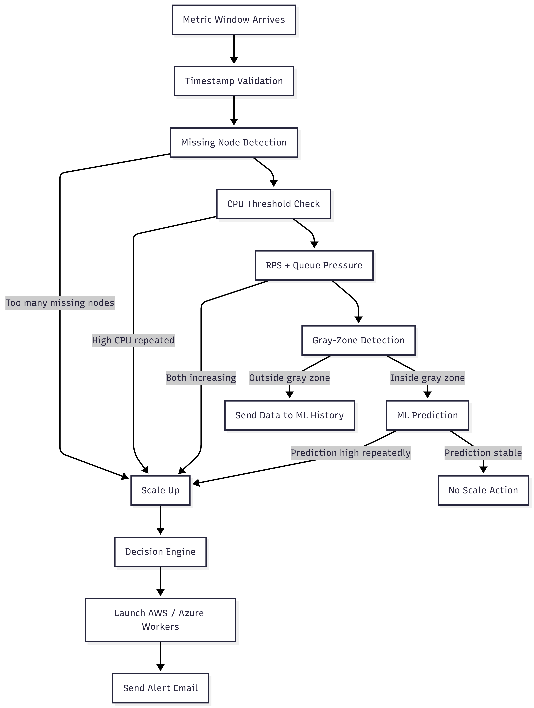

The broker uses multiple signals instead of relying on CPU alone:

| Signal | Meaning | Action |
|---|---|---|
| High CPU window | CPU stays above threshold plus upper buffer | Scale up after repeated windows |
| Queue pressure + RPS | Application demand is rising | Scale up when both trends are increasing |
| Missing nodes | Expected workers stopped reporting | Scale up if missing count crosses tolerance |
| Gray-zone CPU | CPU is close to threshold but not clearly overloaded | Ask ML for prediction |
| Normal load | Metrics are below the decision band | Store metric row for ML history |

This makes scaling less jumpy than a single threshold check. The broker waits for repeated windows before acting, which helps avoid launching new instances because of one noisy metric sample.

## Scale-Up Lifecycle

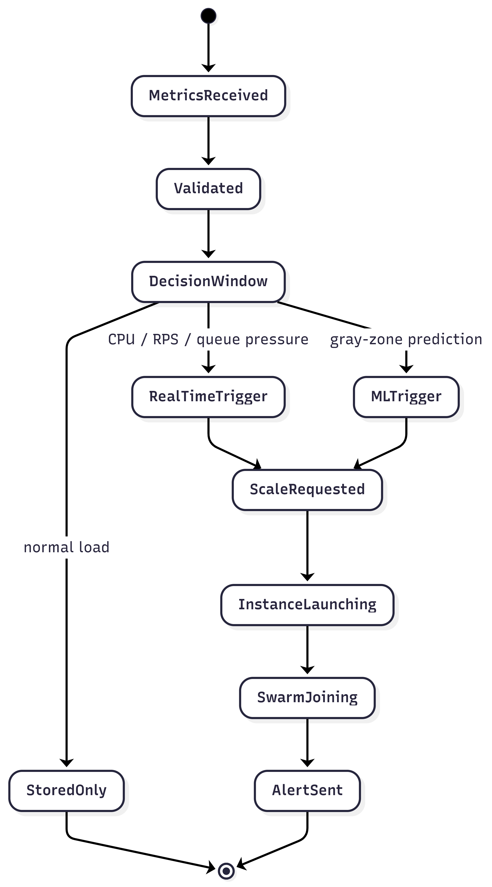

Scale-up is designed as a lifecycle, not just a cloud API call. Once the broker requests capacity, the decision engine splits the requested workers across configured providers, launches instances, injects the Swarm join command, records instance IDs, and triggers an alert. New instances are expected to join the existing Docker Swarm automatically.

## Scale-Down Lifecycle

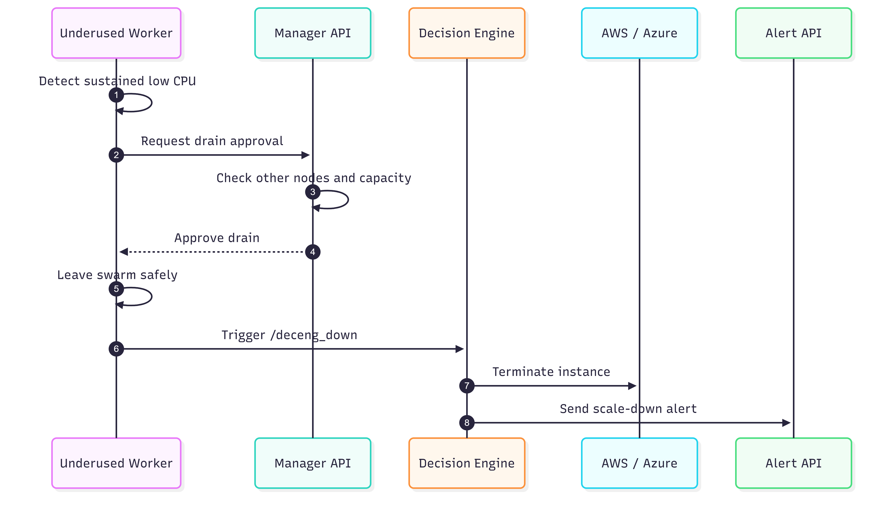

Scale-down is deliberately separate from broker scale-up. A low-utilization node does not remove itself blindly. It asks the manager API for approval. The manager checks that other nodes exist and that sampled nodes are not overloaded. Only then does the worker drain and leave the Swarm before the decision engine terminates the backing cloud instance.

## Request ID Trace

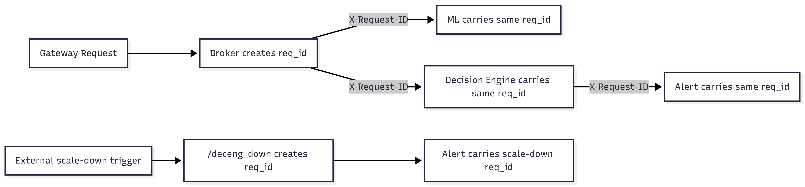

Request IDs are used to connect logs across servers. In the scale-up path, the broker is the first trusted backend service, so it creates the `req_id`. In scale-down, `/deceng_down` is an external entry point, so the decision engine creates a new `req_id` for that separate lifecycle.

## Components

| Component | Path | Responsibility |
|---|---|---|
| Broker API | `broker/` | Ingests metrics and decides scale-up actions |
| ML API | `ml/` | Stores metric history and predicts CPU usage |
| Decision Engine | `deceng/` | Creates and removes AWS/Azure workers |
| Alert API | `alert/` | Sends scaling notifications |
| Gateway Scripts | `pipeline/gateway_scripts/` | Receives logs and aggregates metrics |
| Node Scripts | `pipeline/node_scripts/` | Collects node and Nginx metrics |
| Manager API | `system_scripts/manager_api.py` | Approves safe node draining |
| Dashboard | `frontend/` | React metrics dashboard |

## Component Details

### Broker API

The broker is the scaling brain. It receives the aggregated payload from the gateway at `/ingest`, validates timestamp freshness, publishes metrics to Redis, retrieves client configuration, updates rolling decision counters, and triggers either ML calls or decision engine calls.

The broker works with:

- Client thresholds and buffer values.
- Last scaling timestamps.
- CPU windows and fluctuation counters.
- Queue pressure and RPS trend counters.
- ML prediction windows.
- Missing server count.

### ML API

The ML service handles two paths:

- `/insert` stores normal metric rows for future training/history.
- `/prediction` loads the client CSV and model, builds lag/rolling/delta features, and returns predicted CPU.

The ML service is only used when the broker decides the current CPU is in the gray zone. This keeps prediction focused on ambiguous cases instead of making every scaling decision depend on ML.

### Decision Engine

The decision engine owns infrastructure operations. For scale-up, it receives the broker request, calculates how many workers should go to AWS and Azure, launches instances, writes pending instance IDs, and sends a notification. For scale-down, it removes a specific instance from the correct provider.

### Manager API

The manager API runs near the Docker Swarm manager. Its job is to protect cluster capacity during scale-down. It checks node readiness and other-node load before allowing a worker to drain.

### Alert API

The alert service sends scaling notifications through SMTP. It receives the same `req_id` as the scaling event, which makes alert logs traceable back to the broker or decision engine flow.

## Service Ports

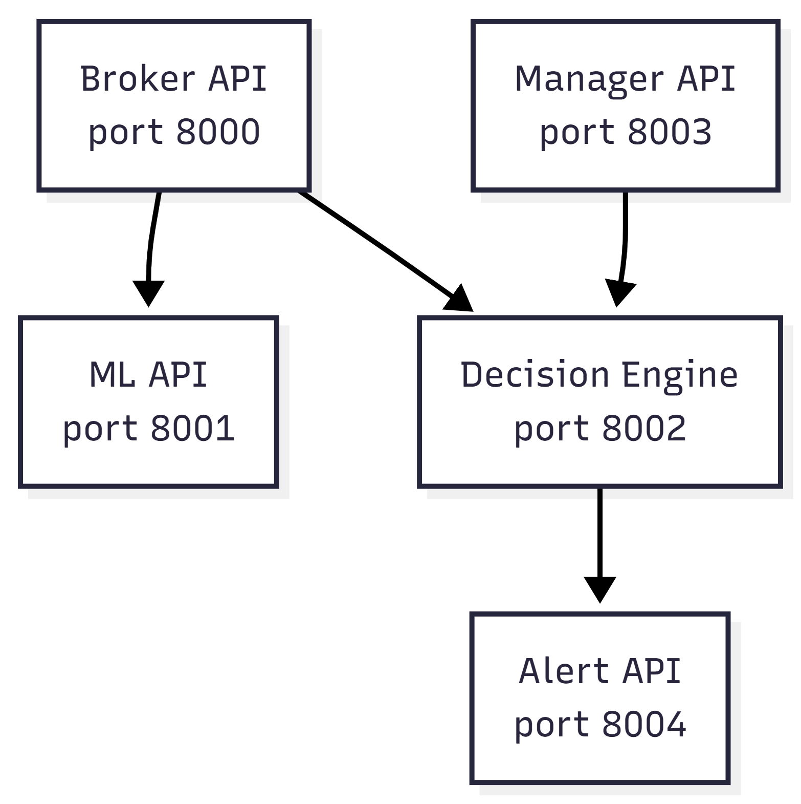

These ports represent the local service defaults. During multi-server testing, each service can run on its own machine as long as the URLs in each `.env` file point to the correct host and port.

## Metric Pipeline

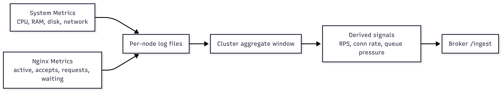

The metric pipeline has two levels. Node scripts collect raw per-node data. Gateway scripts aggregate those files into one cluster-level view. This keeps the broker from receiving many small node-level requests and lets it make decisions from a single normalized window.

The broker payload includes:

| Field Group | Examples |
|---|---|
| Time/window | `timestamp`, `freeze_window` |
| CPU | `cpu_percentage`, `cpu_idle_percent` |
| Memory/disk/network | `total_ram`, `ram_used`, `disk_usage_percent`, `network_in`, `network_out` |
| Connections | `live_connections`, `rps`, `conn_rate`, `queue_pressure`, `rps_per_node` |
| Cluster state | `server_expected`, `server_responded`, `missing_server` |
| Ownership | `client_id` |

## ML Feature Flow

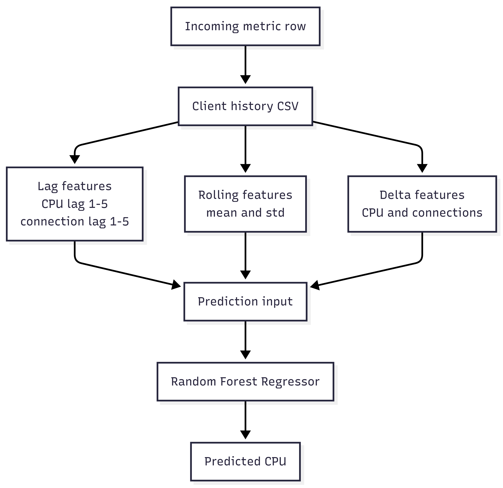

The ML model predicts the next CPU value from the current metric row plus recent history. The broker does not send a complete feature matrix. It sends the current values, and the ML service builds the feature row from the client history file.

Feature families:

- Current CPU and live connections.
- CPU lag values from previous windows.
- Live-connection lag values from previous windows.
- Rolling CPU mean and standard deviation.
- Delta between current and previous CPU/connection values.

## Repository Layout

```text
TrafficXShaper/
+-- alert/                  Alert API and SMTP email sender
+-- broker/                 Broker API, scaling logic, DB/Redis access
+-- dashboard/              Resource creation scripts
+-- deceng/                 AWS/Azure scale-up and scale-down engine
+-- frontend/               React dashboard
+-- ml/                     ML API, prediction, insertion, training
+-- pipeline/
|   +-- gateway_scripts/    Aggregation and receiver scripts
|   +-- node_scripts/       Worker metric collectors
+-- system_scripts/         Manager API and node lifecycle scripts
```

The project is intentionally organized by runtime responsibility rather than one monolithic app. Each service has its own `main.py`, settings, logging setup, and operations folder. This matches the testing plan where APIs can run on different servers.

## API Surface

| Service | Endpoint | Purpose |
|---|---|---|
| Broker | `POST /ingest` | Receives aggregated metrics |
| Broker | `GET /health` | Broker health check |
| ML | `POST /insert` | Stores metrics for training/history |
| ML | `POST /prediction` | Returns predicted CPU usage |
| ML | `GET /health` | ML health check |
| Decision Engine | `POST /deceng` | Launches new workers |
| Decision Engine | `POST /deceng_down` | Terminates a worker |
| Decision Engine | `GET /health` | Decision engine health check |
| Alert | `POST /email` | Sends scale event email |
| Alert | `GET /health` | Alert service health check |
| Manager | `POST /manager` | Approves and drains Swarm node |

## Configuration Model

Each service reads its own environment settings through `pydantic-settings`. The important configuration boundaries are:

| Service | Configuration Responsibilities |
|---|---|
| Broker | ML URLs, decision engine URL, DB settings, Redis settings, log paths |
| ML | Model/data base path and log paths |
| Decision Engine | Cloud credentials, image IDs, subnet/security data, alert URL |
| Alert | SMTP sender and app password |
| Pipeline | Broker URL, file paths, client ID, receiver IPs |

This makes the services portable across test servers. For example, the broker only needs to know where ML and the decision engine are; it does not need cloud credentials.

## High-Level Deployment

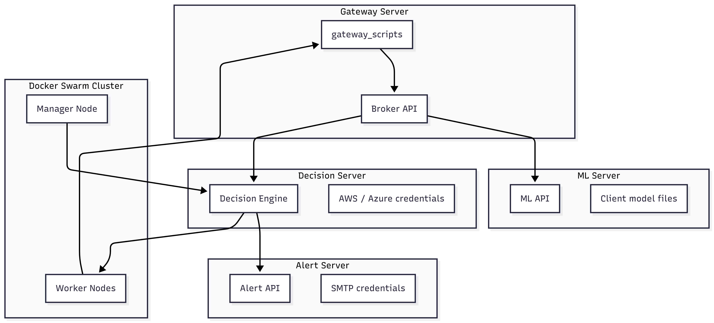

In a test deployment, the gateway and broker can run together, while ML, decision engine, and alerting can run on separate hosts. Worker nodes send metrics to the gateway, not directly to the broker. The decision engine must have access to AWS/Azure credentials and network settings because it is the only service responsible for creating infrastructure.

## End-to-End Behavior

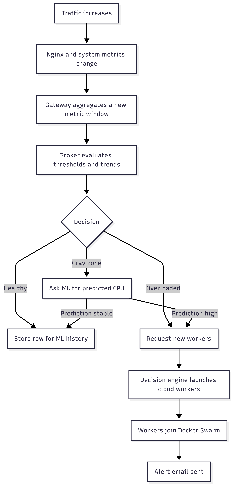

TrafficXShaper therefore combines reactive and predictive scaling. Reactive rules handle obvious overload. Predictive ML handles the uncertain middle area. Swarm lifecycle scripts handle safe removal when load later falls.
